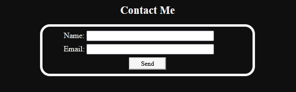
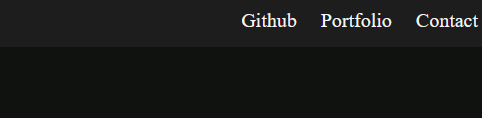

# Landing-Page
## Description

- I am building a website to house my professional links and as a point of contact. I want people to be able to leave me their contact info to reach out in a neat, well-padded form. The page has links at the top for easy navigation to the contact form, as well as my portfolio and github. Doing this has solidified the structure of css and html in my mind, as well as things I really needed to remember the syntax of.

## Usage

Feel free to reach out to me on the contact form, and browse my Github projects and portfolio.

 

 

## Credits

I worked with a few people in class, though it went a bit fast for me to totally remember. I'll just say thanks to the breakout groups for your help as well as the class discord, and Jack.

## License

This work is licensed under a Creative Commons Attribution-NonCommercial-NoDerivatives 4.0 International License.

For a summarized copy please visit https://creativecommons.org/licenses/by-nc-nd/4.0/ For an updated copy please visit https://creativecommons.org/licenses/by-nc-nd/4.0/legalcode

## Features
-navigation links
-contact form
